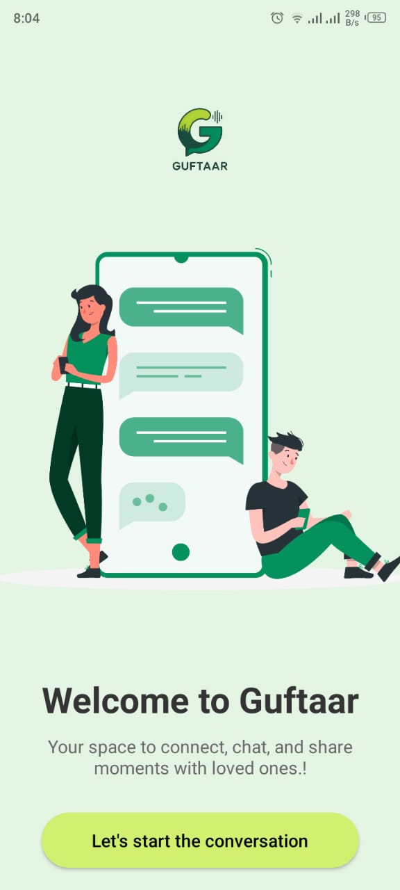
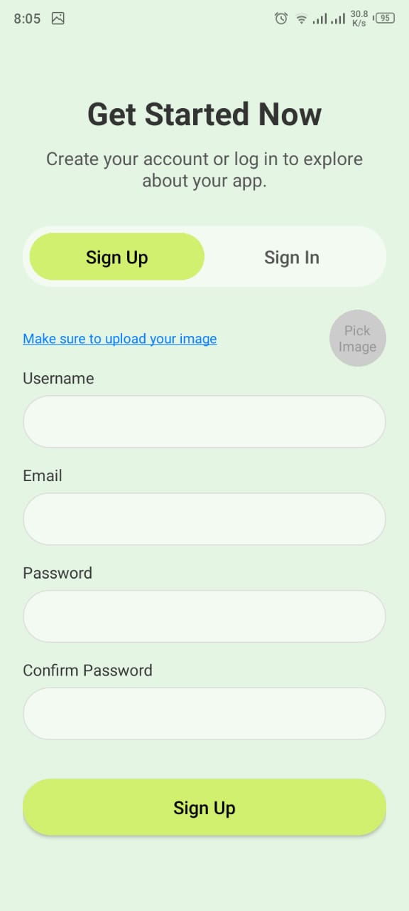
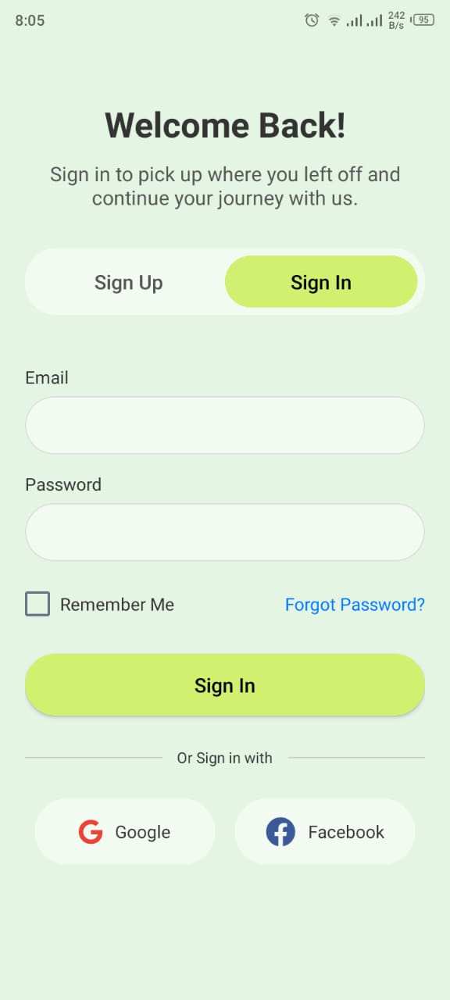
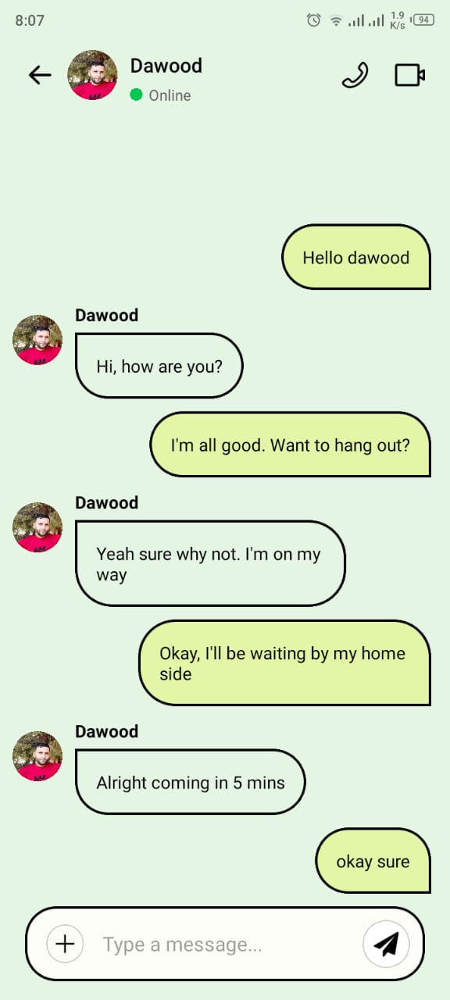
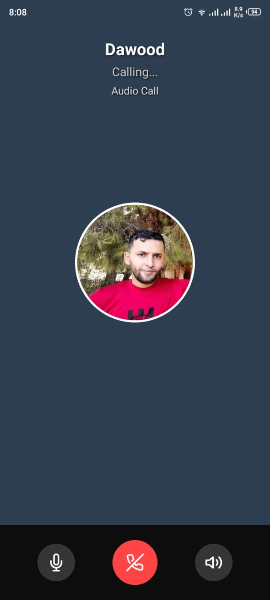
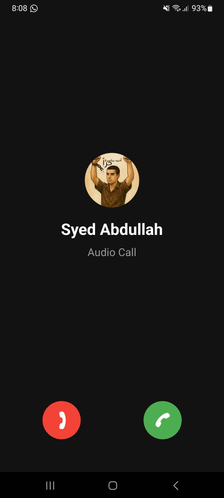
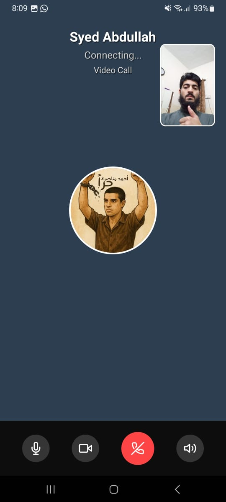

# Guftaar - React Native Chat App

A real-time chat application built with **React Native (Expo)** and **Firebase**, featuring one-on-one messaging, **audio/video calls via WebRTC**, and a smooth UI/UX powered by **React Navigation** and **TypeScript**.

## Features

- User authentication (Firebase)
- Real-time chat (Socket.io + Firebase)
- Audio & Video calling (WebRTC)
- Seamless navigation (React Navigation)
- Cross-platform support (iOS & Android via Expo)
- TypeScript for safer, scalable code

## Tech Stack

| Category           | Technologies Used                            |
|--------------------|-----------------------------------------------|
| Mobile Framework   | React Native (Expo)                           |
| Language           | TypeScript                                    |
| Backend / Realtime | Firebase (Auth, Firestore), Socket.io         |
| Calling            | WebRTC                                        |
| Navigation         | React Navigation                              |


## Getting Started

### Prerequisites

- Node.js & npm/yarn
- Expo CLI
- Firebase Project Setup
- A backend server for Socket.io (for chat functionality)


### Clone the Repository

```bash
git clone https://github.com/your-username/chat-app.git
cd chat-app
```

### Install Dependencies

```bash
npm install
# or
yarn install
```
### Start the app

```bash
npx expo start
```

## Firebase Setup

Go to Firebase Console

Create a new project

Add a web app to get your Firebase config

Enable Authentication (Email/Password)

Create Firestore Database

Replace your Firebase config in the project at firebaseConfig.ts
## Socket.io Backend

This app expects a running Node.js server with Socket.io to handle real-time communication. Basic example setup:

```bash
const io = require("socket.io")(PORT, {
  cors: {
    origin: "*",
  },
});

io.on("connection", (socket) => {
  console.log("A user connected:", socket.id);

  socket.on("send_message", (data) => {
    socket.broadcast.emit("receive_message", data);
  });

  socket.on("disconnect", () => {
    console.log("User disconnected");
  });
});
```
## Screenshots

Here’s a preview of what Guftaar looks like:

<div style="flex-direction: row; gap: 10px;">
  
  
  
  
  
  
  
  
  
</div>


## Contact

For any queries or suggestions, feel free to reach out at abdullah.works.dev@gmail.com.